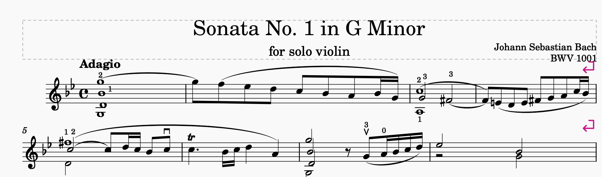
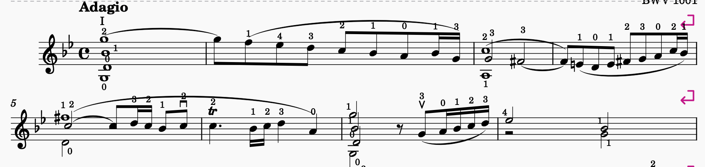

# ViolinFingering

Automatic violin fingering for MuseScore Studio 4.4+.

Computes (string, finger, position) for every note of a violin score using
position-aware Viterbi dynamic programming, and writes finger numbers and
Roman-numeral position marks as annotations on the staff.

The fingering is determined by the key signature: in each (string, position)
the four fingers play four consecutive scale tones of the key. Accidentals
displace a finger by a semitone from its key position. Chords are solved as
joint hand frames; harmonic notes (notated with both 0 and a finger digit)
break the fingering chain into independently-optimized segments.

Existing finger-number and string-number annotations are honored as
constraints.

Repository: https://github.com/knoguchi/violin-fingering
Bug reports and feature requests: https://github.com/knoguchi/violin-fingering/issues

## Before / after

Original:

Annotated by the plugin:

## Setup
1. Copy this folder to `Documents/MuseScore4/Plugins/` and restart MuseScore.
2. Enable the plugin in Home > Plugins.
3. Open a violin score and run the plugin from the Plugins menu.

## Usage
- **Run**: computes fingering for the selection (or the whole score) and writes
  finger numbers and position marks as annotations on the staff.
- **Diagnose**: prints solver statistics without writing.
- **Copy log**: copies the full report to the clipboard.

Checkboxes control which kinds of annotation to write (finger numbers,
positions, string numbers).

## Algorithm overview
- State: (string, finger, position) per note, with accidental offset
- Candidates for each pitch: enumerated by the key-signature finger layout
- Cost: position-shift (heavy), string movement, accidental displacement,
  with mild open-string and low-position preferences for tie-breaking
- Chord events solved as joint hand frames; open strings inherit position
- Harmonics split the piece into independent segments

## Known limitations
- Tuning is fixed at standard violin (G3 D4 A4 E5)
- Harmonics (other than the 0+finger notation) are not specially detected
- Pizzicato, col legno, and other special techniques are processed as
  ordinary notes
- The fingering optimizes for playability ("can be played"), not for
  expressive choices like timbre or string color, which experienced
  violinists would make manually

## License
GPL-3.0. Copyright (C) 2026 Kenji Noguchi <tokyo246@gmail.com>.
