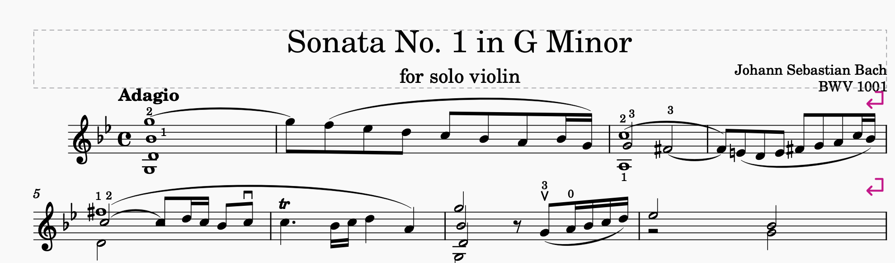
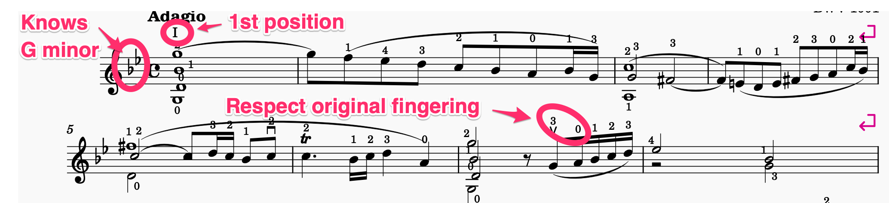

# ViolinFingering

Automatic violin fingering for MuseScore Studio 4.4+.

Computes (string, finger, position) for every note of a violin score using
position-aware Viterbi dynamic programming, and writes finger numbers and
Roman-numeral position marks as annotations on the staff.

The fingering is determined by the key signature: in each (string, position)
the four fingers play four consecutive scale tones of the key. Accidentals
displace a finger by a semitone from its key position. Chords are solved as
joint hand frames; harmonic notes (notated with both 0 and a finger digit)
break the fingering chain into independently-optimized segments.

Existing finger-number and string-number annotations are honored as
constraints.

Repository: https://github.com/knoguchi/violin-fingering
Bug reports and feature requests: https://github.com/knoguchi/violin-fingering/issues

## Before / after

Original:

Annotated by the plugin:

## Setup
1. Copy this folder to `Documents/MuseScore4/Plugins/` and restart MuseScore.
2. Enable the plugin in Home > Plugins.
3. Open a violin score and run the plugin from the Plugins menu.

## Usage
In a multi-part score, the selection picks the part: select a range on the
staff you want fingered (e.g. Violin 2) and Run works on that staff only.
With no selection, the top staff is processed. Repeat per part.

- **Run**: computes fingering for the selection (or the whole score) and writes
  finger numbers and position marks as annotations on the staff.
  Re-running (e.g. after a plugin update) replaces the plugin's own previous
  annotations: everything the plugin writes is tracked in a score meta tag
  and colored blue (or a near-black #010101 when "Color auto-written
  annotations" is unchecked). Manual annotations are honored as
  constraints — including plugin-written ones you have since edited, which
  are recolored to plain black to show they are now yours. Check "Replace
  manual fingerings too" to discard those as well (harmonic notation is
  always preserved).
- **Clear**: removes the plugin's annotations from the selection (or the
  whole score). Manual annotations are untouched unless "Replace manual
  fingerings too" is checked.

Checkboxes control which kinds of annotation to write (finger numbers,
positions, string numbers).

## Algorithm overview
- State: (string, finger, position) per note, with accidental offset
- Candidates for each pitch: enumerated by the key-signature finger layout
- Cost: position-shift (heavy, discounted when masked by an open string),
  bow crossing (convex in string distance: adjacent cheap, skips expensive),
  same-finger string crossing (with a barre exception for perfect fifths on
  adjacent strings), same-finger semitone slides, finger stretches beyond
  the hand frame, accidental displacement, with mild open-string and
  low-position preferences for tie-breaking
- Chord events solved as joint hand frames; open strings inherit position
- Harmonics split the piece into independent segments

## Known limitations
- Tuning is fixed at standard violin (G3 D4 A4 E5)
- Harmonics (other than the 0+finger notation) are not specially detected
- Pizzicato, col legno, and other special techniques are processed as
  ordinary notes
- The fingering optimizes for playability ("can be played"), not for
  expressive choices like timbre or string color, which experienced
  violinists would make manually

## License
GPL-3.0. Copyright (C) 2026 Kenji Noguchi <tokyo246@gmail.com>.
