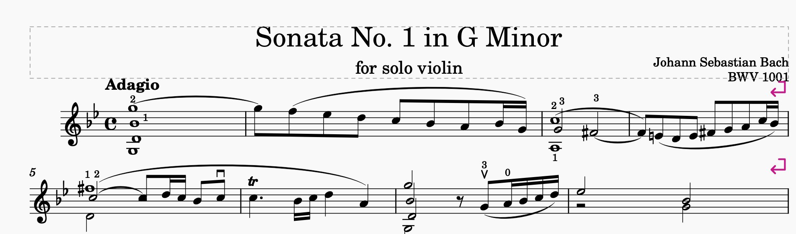
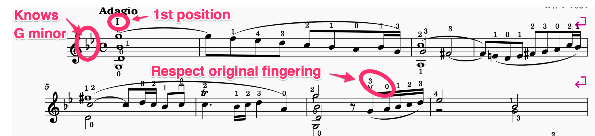

# ViolinFingering

Automatic fingering for violin, viola and (experimental) cello in
MuseScore Studio 4.4+.

Computes (string, finger, position) for every note of a violin, viola or
cello score using position-aware Viterbi dynamic programming, and writes
finger numbers and Roman-numeral position marks as annotations on the staff.

For violin and viola the fingering is determined by the key signature: in each
(string, position) the four fingers play four consecutive scale tones of the
key. Accidentals displace a finger by a semitone from its key position. The
cello (experimental) uses a chromatic hand frame instead: the four fingers of
a position sit on consecutive semitones, whatever the key. Chords are solved as
joint hand frames; harmonic notes (notated with both 0 and a finger digit)
break the fingering chain into independently-optimized segments.

Existing finger-number and string-number annotations are honored as
constraints.

Repository: https://github.com/knoguchi/violin-fingering
Bug reports and feature requests: https://github.com/knoguchi/violin-fingering/issues

## Before / after

Original:

Annotated by the plugin:

## Cello (experimental)
Cello support is new and was written without a cellist: the hand model, the
cost weights and the use of the thumb are starting values. They have been
compared with a cellist's scale fingerings (two octaves, major and melodic
minor), which it now follows for 90% of the notes (the scales are built in as a
key map), and with 86 hand-placed
fingerings in one Bach prelude score (about 60% the same finger; those marks
are sparse and of unknown origin, so this is not a measure of accuracy). The
dialog marks it "experimental" in red. If you play the
cello, reports of what looks wrong are very welcome; a photo of a few bars
with your own fingering is just as useful. See the issues link above.

## Setup
1. Copy this folder to `Documents/MuseScore4/Plugins/` and restart MuseScore.
2. Enable the plugin in Home > Plugins.
3. Open a violin, viola or cello score, select the measures you want (or
   nothing for the whole staff) and run the plugin from the Plugins menu.

## Usage
Select the measures you want fingered (a range on one staff) and run the
plugin: the selection decides the staff and the range. With no selection,
the **Staff** dropdown picks the staff and the whole staff is processed.
One staff at a time: if the selection spans several staves, the first is
used (the dialog says so); repeat per part in a multi-part score.

The staff's instrument is pre-selected from the part. Use the **Instrument**
radio buttons in the dialog to override it (the last choice is
remembered). Viola uses C-G-D-A tuning with the same hand model a fifth
lower. Cello (a chromatic, semitone-per-finger hand frame) and a
5-string violin (C-G-D-A-E) are also offered; the dialog marks them
"experimental" in red.

- **Run**: computes fingering for the selected measures (or the whole staff) and writes
  finger numbers and position marks as annotations on the staff.
  Re-running (e.g. after a plugin update) replaces the plugin's own previous
  annotations: everything the plugin writes is tracked in a score meta tag
  and colored blue (or a near-black #010101 when "Color auto-written
  annotations" is unchecked). Manual annotations are honored as
  constraints — including plugin-written ones you have since edited, which
  are recolored to plain black to show they are now yours. Check "Replace
  manual fingerings too" to discard those as well (harmonic notation is
  always preserved).
- **Clear**: removes the plugin's annotations from the selection (or the
  whole score). Manual annotations are untouched unless "Replace manual
  fingerings too" is checked.

Checkboxes control which kinds of annotation to write (finger numbers,
positions, string numbers).

**Mark finger placement** (off by default) adds beginner-style placement
suffixes to the finger numbers: `1L`, `2L`, `3H`, `4L`. The unmarked
hand shape is 1-23-4 (B C# D E on the A string in first position); a
suffix says the finger sits a semitone lower or higher than that. First
position is measured from the nut, so F natural on the E string is `1L`
in any key; higher positions are measured from where the hand is
placed. The labels are computed after the fingering is solved and do not
change it. Hand-written `2L`/`3H` annotations are honored as finger
constraints like plain digits.

## Algorithm overview
- State: (string, finger, position) per note, with accidental offset
- Candidates for each pitch: enumerated by the key-signature finger layout
- Cost: position-shift (heavy, discounted when masked by an open string),
  bow crossing (convex in string distance: adjacent cheap, skips expensive),
  same-finger string crossing (with a barre exception for perfect fifths on
  adjacent strings), same-finger semitone slides, finger stretches beyond
  the hand frame (within a position only), accidental displacement
- Tie-breaking preferences: per-position costs (I and III are home, II and
  IV cost more than their neighbors), per-string open-string penalties
  (open E most, open G least), high positions slightly dearer on lower
  strings, and enharmonic spelling steering displaced fingers (sharp =
  raised lower finger, flat = lowered upper finger)
- Chord events solved as joint hand frames on contiguous strings; double
  stops may span two positions (fingered tenths); open strings inherit
  position
- Harmonics split the piece into independent segments

## Known limitations
- Cello support is a first cut: chromatic frame with half position and a
  thumb (written as the thumb-position sign); no extensions, and thumb and other weights are
  untuned placeholders (all per-instrument
  values live in `INSTRUMENTS` in `violin_fingering_core.js`)
- Harmonics (other than the 0+finger notation) are not specially detected
- Pizzicato, col legno, and other special techniques are processed as
  ordinary notes
- Note durations, rests, and slurs do not influence costs yet: a shift
  before a whole note is priced like a shift mid-run
- Notes held across other voices (and tied continuations) do not occupy
  their string while later notes are solved
- Notes at the same tick are solved as one chord, so independent voices
  on a staff may collide on a string. Such an event cannot be fingered;
  it is left unannotated and reported in the status line, and the notes
  around it are fingered normally
- Unison double stops (two noteheads on the same pitch) are merged into a
  single note
- Trills and ornament symbols are not seen by the solver (a trilled note
  may get finger 4); grace notes written as small notes are fingered
- The fingering optimizes for playability ("can be played"), not for
  expressive choices like timbre or string color, which experienced
  violinists would make manually

## License
GPL-3.0. Copyright (C) 2026 Kenji Noguchi <tokyo246@gmail.com>.
